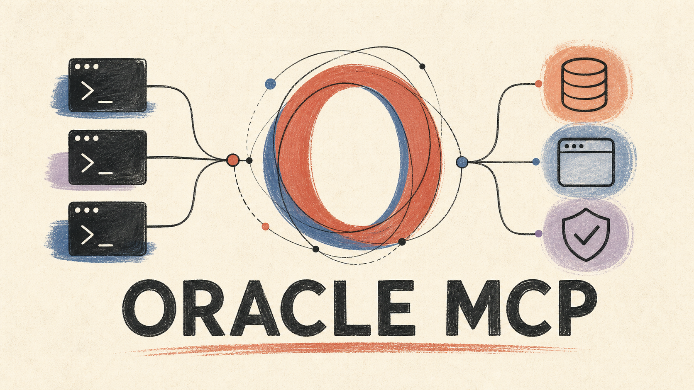
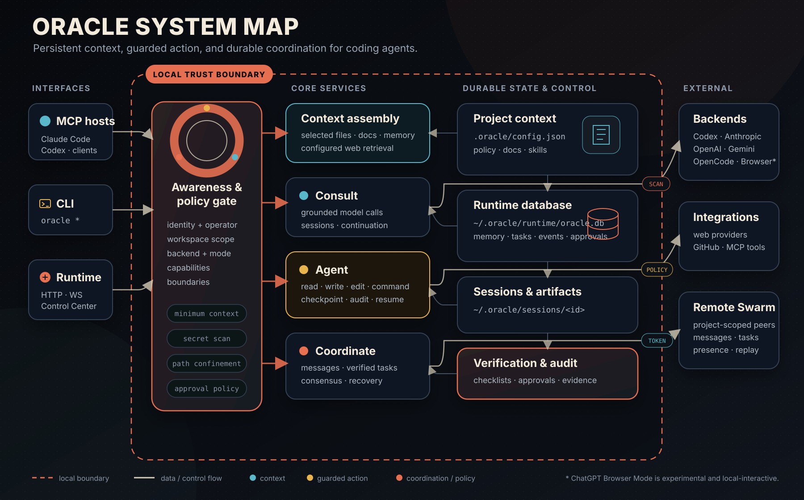

<p align="center">
  
</p>

<h1 align="center">Oracle</h1>

<p align="center">
  <strong>Persistent context, guarded action, and durable coordination for AI coding agents.</strong>
  <br />
  Ground model calls in your workspace, carry decisions across sessions, coordinate multiple agents, and keep humans at the control boundary.
</p>

<p align="center">
  <a href="https://www.npmjs.com/package/@oraclepersonal/oracle"></a>
  <a href="https://nodejs.org/"></a>
  <a href="https://modelcontextprotocol.io/"></a>
  <a href="LICENSE"></a>
</p>

Oracle is a workspace-confined consultation and coordination layer—not another
generic chat shell. It assembles selected project context, injects an explicit
operating identity and safety boundary, routes work to a configured model
backend, and records the result. Its agent, task, Runtime, and Remote Swarm
surfaces extend that same boundary into auditable action.

```text
agent request
    → selected workspace context
    → awareness + policy gate
    → consult / act / coordinate
    → recorded result + evidence
```

## Start in four commands

Oracle requires Node.js 24 or newer. The default backend is the locally
authenticated Codex CLI.

```bash
npm install -g @oraclepersonal/oracle
codex login
oracle doctor
oracle ask "Map the error-handling path and identify one missing test" -f "src/**/*.ts"
```

The final command creates a validated context bundle from the selected files,
runs a grounded consultation, and stores the session under
`~/.oracle/sessions/`.

Want Oracle inside your coding agent instead?

```bash
# Choose the client you use
oracle setup-mcp --client codex
oracle setup-mcp --client claude-code
```

Then restart the client in this workspace. Oracle's MCP instructions teach the
connected agent how to register itself, use memory, coordinate work, and verify
tasks.

> [!TIP]
> Start with `oracle ask` or `oracle_ask`. Add the Runtime, autonomous agent,
> and Remote Swarm only when your workflow needs long-lived state or guarded
> mutation.

## What Oracle adds

| Layer | What it does | Primary interface |
|---|---|---|
| **Aware** | Derives a live snapshot of Oracle's role, operator, workspace label, backend, available capabilities, and enforced boundaries. | `oracle identity awareness` · `oracle_awareness_show` |
| **Consult** | Bundles selected files and context, scans outbound content, calls the chosen backend, and records a replayable session. | `oracle ask` · `oracle_ask` |
| **Remember** | Maintains project/global facts, insights, local docs, entity links, and ranked retrieval when configured. | `oracle memory` · `oracle_memory_*` |
| **Act** | Runs a checkpointed coding loop with workspace tools, read-only mode, policy checks, approval gates, and audit evidence. | `oracle agent` · `oracle_agent` |
| **Coordinate** | Connects agents through messages, presence, checklist-gated tasks, consensus, and recovery. | `oracle msg` / `oracle task` · `oracle_msg_*` / `oracle_task_*` |
| **Operate** | Owns long-lived schedules, approvals, SQLite state, HTTP APIs, WebSocket events, and the human Control Center. | `oracle daemon` · `oracle control` |
| **Companion** | Turns fresh semantic presence into an explainable `speak` or `silence` intent without storing raw coordinates, and can raise an opt-in local notification. | `oracle companion` · Runtime API |
| **Govern** | Exposes Awareness, Control, Transform, and Boundary signals without presenting them as a security certification. | `oracle governance` · audit and approval tools |

### One core, four surfaces

| Surface | Use it when | Entry point |
|---|---|---|
| **CLI** | A human or script needs direct consult, agent, memory, task, or Runtime commands. | `oracle` |
| **Full MCP server** | Claude Code, Codex, or another MCP host needs the complete Oracle tool surface. | `oracle-mcp` |
| **Coordination-only MCP server** | Agents need messaging and verified tasks without loading provider, memory, or agent dependencies. | `oracle-msg-mcp` |
| **Runtime API + Control Center** | Scheduling, remote coordination, approvals, or event replay must survive individual CLI sessions. | `oracle-daemon` |

## Architecture and trust boundaries

<p align="center">
  
</p>

The diagram is intentionally boundary-first:

1. **Interfaces stay interchangeable.** CLI, MCP, and Runtime enter the same
   context and policy path.
2. **Only selected context leaves the workspace.** File resolution, size
   limits, and secret detection run before a consult reaches an external
   backend.
3. **Mutation is a separate capability.** Agent backends can be read-only,
   policy-constrained, step-limited, checkpointed, or paused for human
   approval.
4. **Local admin and remote coordination use different credentials.** Remote
   Swarm tokens are project-scoped and do not grant shell, filesystem,
   Scheduler, approval, or Runtime-admin access.
5. **Evidence returns to durable state.** Sessions, messages, task transitions,
   approvals, events, and audit records remain inspectable after a model call
   ends.

### The consultation path

```text
Question
  │
  ├─ selected files and globs
  ├─ relevant memory and local docs
  ├─ conversation continuation, when supported
  └─ live awareness: identity · operator · interface · backend · boundaries
          │
          ▼
  bundle validation + secret scan
          │
          ▼
  Codex / Anthropic / OpenAI / Gemini / OpenCode / configured backend
          │
          ▼
  session output + usage + artifacts
```

## Common workflows

### Ground a review in real files

```bash
oracle ask \
  "Review the authorization boundary. Separate evidence from assumptions." \
  -f "src/auth/**/*.ts" "src/**/*.test.ts"
```

Add `--conversation <id>` to continue a logical thread, or `--include-docs` to
retrieve from the workspace's `.oracle/docs/` knowledge base.

### Investigate before allowing changes

```bash
oracle init workspace
oracle agent "Find the cause of the flaky scheduler test" --read-only
```

When the plan is clear:

```bash
oracle agent \
  "Fix the flaky scheduler test and verify the focused suite" \
  --plan \
  --review \
  --approval-mode risky
```

Agent-capable backends are currently `codex`, `anthropic`, and `opencode`.
Command policy and workspace path checks reduce risk, but they are not a
replacement for OS- or container-level isolation.

### Coordinate agents with verified tasks

```bash
oracle task create \
  --title "Harden provider retries" \
  --created-by lead \
  --assignee backend \
  --checklist "reproduce failure" "implement fix" "tests pass"

oracle msg inbox --agent lead --wait --timeout 120
```

An assignee cannot submit a task for review while any checklist item remains
unchecked. Recovery replays interrupted task-to-message delivery without
duplicating the event.

### Start the persistent Runtime

```bash
oracle daemon start
oracle daemon status
oracle control
```

The Runtime listens on `127.0.0.1:4777` by default and stores canonical state in
`~/.oracle/runtime/oracle.db`. It owns schedules, approvals, event replay,
authenticated local APIs, and project-scoped Remote Swarm endpoints.

```bash
oracle schedule add "focused tests" "0 */2 * * *" "npm test"
oracle schedule list
oracle daemon events
```

### Let Oracle consider starting a conversation

Situated Companion runs inside the local Runtime. It accepts semantic context,
never coordinates, and records why it chose to speak or remain silent.

```bash
oracle companion presence away --source device --ttl 30
oracle companion presence home --source geofence --confidence 0.9 --ttl 180
oracle companion status
```

`focus`, `transit`, expired context, quiet hours, and a paused Companion fail
closed to silence. Use `oracle companion pause`, `resume`, or `forget` for
immediate control.

A `speak` intent can reach a local notification channel, but only one the user
has turned on — every channel ships disabled:

```bash
oracle companion channel enable windows-toast
oracle companion notify-test
oracle companion deliveries
```

The Boundary runs again at delivery time, silence never reaches a channel, a
cooldown prevents repeated notifications, and each intent is delivered at most
once. Nothing leaves the machine. See [Situated Companion](docs/companion.md).

### Coordinate across machines

Remote Swarm is a coordination plane, not a remote execution plane.

```bash
# On the Runtime host
oracle daemon start --remote --host 0.0.0.0 --port 4777
oracle team token --project oracle --agent reviewer --role reviewer

# On the agent machine
export ORACLE_SWARM_TOKEN="oracle_swarm_..."
oracle connect https://oracle.example.com --project oracle --agent reviewer
oracle team inbox
```

The built-in listener is HTTP. Put non-loopback deployments behind TLS or an
encrypted private network; do not expose port 4777 directly to the public
internet.

## Execution backends

Backend selection can come from `--backend`, `.oracle/config.json`, model
routing, or environment configuration.

| Backend | Consult | Agent loop | Authentication / note |
|---|:---:|:---:|---|
| **Codex CLI** | Yes | Yes | Default; uses `codex login` |
| **Anthropic** | Yes | Yes | `ANTHROPIC_API_KEY` or `oracle login --provider anthropic` |
| **OpenAI** | Yes | No | `OPENAI_API_KEY` |
| **Gemini** | Yes | No | `GEMINI_API_KEY` or `GOOGLE_API_KEY` |
| **OpenCode-compatible** | Yes | Yes | OpenAI-compatible endpoint and configured credentials |
| **Azure OpenAI / OpenRouter** | Yes | No | Provider-specific endpoint and credentials |
| **ChatGPT Browser Mode** | Yes | No | Experimental, headed Chrome, manual account login, local-interactive use |

Inspect the route before debugging model behavior:

```bash
oracle models
oracle doctor --backend anthropic
```

### Minimal project configuration

Initialize a project-local boundary:

```bash
oracle init workspace
```

Then edit `.oracle/config.json`:

```json
{
  "backend": "codex",
  "model": "auto",
  "include": ["src/**/*.ts", "docs/**/*.md"],
  "exclude": ["**/node_modules/**", "**/dist/**", "**/*.secret"]
}
```

Configuration, policy, docs, and skills live under the project's `.oracle/`
directory. User-level sessions, identity, memory, and Runtime state live under
`~/.oracle/`.

### Where memory is stored

`memory.store` selects the durable memory backend. The default keeps everything
on this machine.

```bash
oracle memory store              # show the current setting
oracle memory store hybrid       # local canonical + mirror to ChatGPT
```

| Store | Durable copy lives in | Use when |
|---|---|---|
| `local` (default) | This machine (SQLite/file, optionally the `oracle-memory` MCP sidecar) | You want full fidelity and nothing leaving the machine. |
| `chatgpt` | The signed-in ChatGPT account's Saved Memory | You want ChatGPT web conversations to be the single source of memory. |
| `hybrid` | This machine, plus a mirror of selected entries in Saved Memory | You want local search and graph features *and* shared context on chatgpt.com. |

```json
{
  "memory": {
    "store": "hybrid",
    "remoteCacheTtlMinutes": 10,
    "mirror": {
      "minImportance": 0.7,
      "types": ["fact", "insight"],
      "tags": ["shared"]
    }
  }
}
```

`chatgpt` and `hybrid` drive the signed-in session through the
`chatgpt-browser` backend, so they inherit every [Browser Mode](docs/browser-mode.md)
limitation. ChatGPT Saved Memory is a weaker store than the local one, and
Oracle does not paper over the difference:

- Entries have no ids, tags, importance, or timestamps. Oracle keeps those in a
  local shadow index and joins them to the remote text by content hash.
- Each entry is capped at 2000 characters; larger writes are rejected in
  `chatgpt` mode and skipped by the mirror in `hybrid` mode.
- Reads are a natural-language round-trip, so ordering and completeness are
  best-effort. An unreadable account surfaces as an error, never as "no memories".
- Writes and deletes only count as done when ChatGPT confirms them.
- `working` memory always stays local — it is short-lived scratch state, and
  Saved Memory is account-wide and user-visible.
- In `hybrid` mode, `oracle memory forget` removes the local copy only. The
  mirrored entry stays in your account until you delete it from ChatGPT
  settings → Personalization → Manage memory.
- A failed mirror never fails the local write; it is logged and reported.

Entity graph, consolidation, decay, and reflection are local-only features in
every mode.

## Security model

Oracle treats model calls, workspace mutation, local administration, and remote
coordination as different trust boundaries.

| Boundary | Control |
|---|---|
| **Workspace** | Real paths are resolved against the active workspace; traversal and escaping symlinks are rejected by guarded file paths. |
| **Outbound context** | Selected content is constrained by file/input limits and scanned for likely secrets before transmission. |
| **Agent mutation** | Read-only mode removes mutating tools; policy, step ceilings, checkpoints, approval modes, and audit records guard enabled actions. Optional Docker mode adds a workspace-confined execution boundary. |
| **Runtime admin** | Local `/v1/*` APIs require the owner-only Runtime token. Status output redacts it. |
| **Remote Swarm** | Raw tokens are printed once; only SHA-256 token hashes are stored. Requests and events remain project-scoped. |
| **Browser Mode** | Uses an isolated, visible Chrome profile and manual login. It is experimental UI automation, not the OpenAI API. |

For isolated command execution, enable the [Docker execution sandbox](docs/sandbox.md) and verify it with `oracle sandbox doctor`.

Important limits:

- Docker sandboxing is optional and requires a working Docker daemon. The
  default command runner is policy-constrained, not a kernel sandbox.
- Web retrieval works only when a provider is configured and explicitly used.
- Conversation continuation depends on backend support; it is not a universal
  promise that every model remembers every prior answer.
- The ACTB governance report describes Oracle's current controls; it is not an
  external audit or compliance certification.

Read [Architecture](docs/architecture.md), [Runtime](docs/runtime.md), and
[ChatGPT Browser Mode](docs/browser-mode.md) before deploying beyond a local
developer workstation.

## Command map

```text
oracle ask                  grounded consultation
oracle agent                autonomous or read-only coding loop
oracle memory / wiki        memory inspection and compilation
oracle docs / web           local knowledge and configured retrieval
oracle msg / task           local coordination and verification
oracle team / swarm         remote and consensus workflows
oracle daemon / schedule    persistent Runtime and cron ownership
oracle control / approval   human oversight
oracle identity             operator, persona, and awareness
oracle audit / governance   evidence and policy status
oracle sandbox doctor       execution boundary and Docker readiness
oracle github               pull requests and issues through gh
oracle browser              experimental ChatGPT Browser Mode
```

Run `oracle --help` or open the
[complete CLI reference](docs/cli-reference.md) for command-specific options.

## Documentation

| Goal | Read |
|---|---|
| Install and complete a first consult | [Getting started](docs/getting-started.md) |
| Understand components and storage | [Architecture](docs/architecture.md) |
| Configure a workspace | [Configuration schema](docs/config-schema.md) |
| Look up CLI options | [CLI reference](docs/cli-reference.md) |
| Connect an MCP client | [MCP standards and tool surface](docs/MCP-STANDARDS.md) |
| Coordinate local agents | [Messaging and verified tasks](docs/MESSAGING.md) |
| Run the daemon and API | [Runtime](docs/runtime.md) |
| Operate approvals and oversight | [Control Center](docs/control-center.md) |
| Configure isolated execution | [Execution sandbox](docs/sandbox.md) |
| Connect agents across machines | [Remote Swarm](docs/remote-swarm.md) |
| Use the experimental browser backend | [ChatGPT Browser Mode](docs/browser-mode.md) |
| Diagnose failures | [Troubleshooting](docs/troubleshooting.md) |

## Development

```bash
git clone https://github.com/OraclePersonal/Oracle.git
cd Oracle
npm install
npm run build
npm test
```

Run the complete release gate before publishing:

```bash
npm run verify
```

The package exposes four binaries:

```text
oracle            main CLI
oracle-mcp        full stdio MCP server
oracle-msg-mcp    coordination-only stdio MCP server
oracle-daemon     persistent Runtime
```

## Project lineage

Oracle builds on the vision and open-source prototype created by
[Peter Steinberger](https://github.com/steipete) at
[steipete/oracle](https://github.com/steipete/oracle). This project extends
that consultation workflow into persistent memory, explicit identity,
multi-agent coordination, guarded action, and a local control plane.

## License

[MIT](LICENSE)
