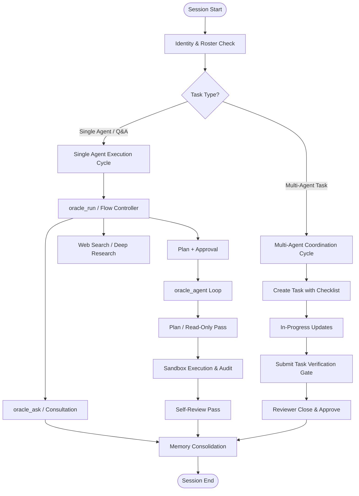
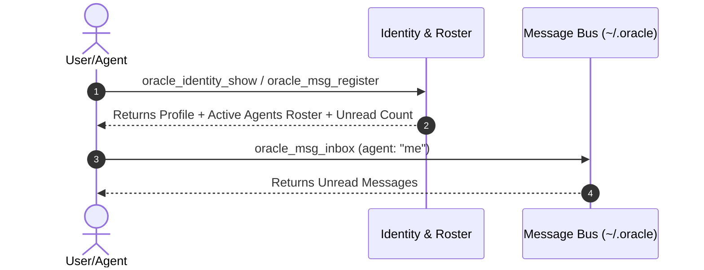
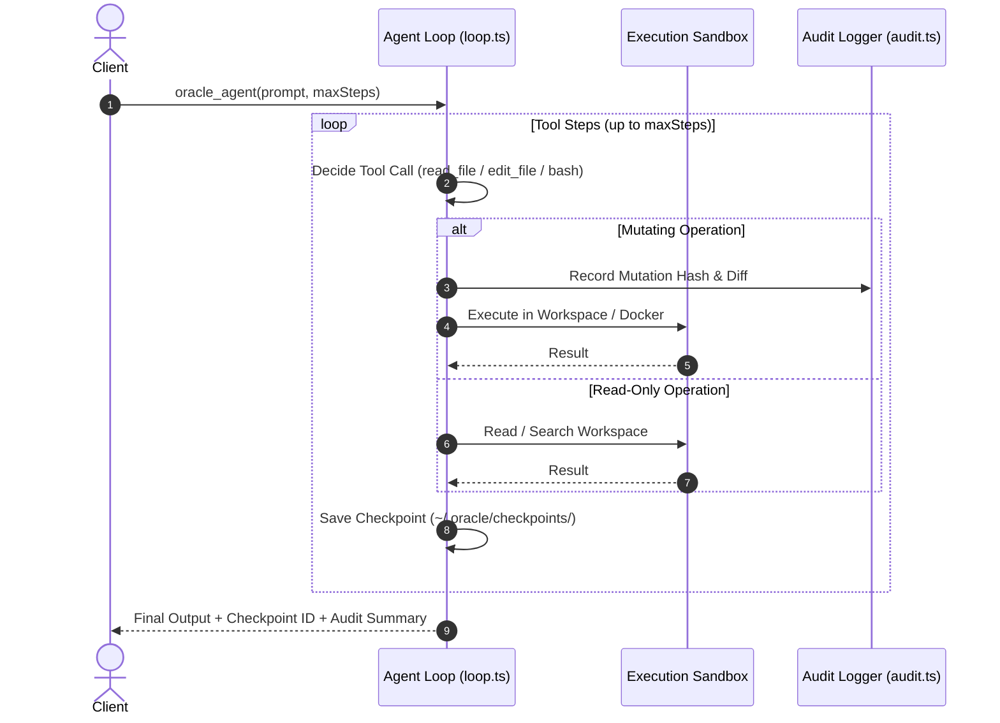
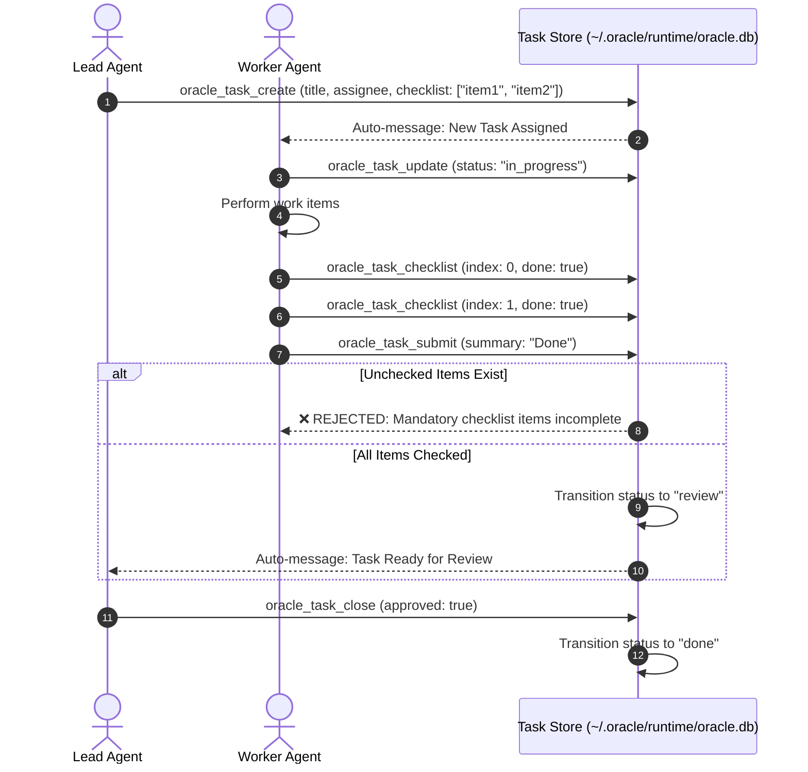

# Oracle Standard Working Process (SOP) & Workflows

This document details the standard operating procedures and workflows for humans and AI agents interacting with **Oracle-Ecosystems**.

---

## 1. Overview of System Workflows

Oracle operates across three core lifecycle phases:

1. **Session & Identity Phase**: Establish context, agent persona, and recall past knowledge.
2. **Execution Phase (Single Agent)**: Investigate code, create plans, execute mutations inside sandboxes, and perform self-reviews.
3. **Coordination Phase (Multi-Agent)**: Distribute tasks, track progress across agents, verify completion via gates, and report results.



---

## 2. Phase 1: Session & Identity Onboarding

Every agent or CLI session MUST establish its identity and check for background updates or unread messages before executing work.

### Sequence Flow



> [!NOTE]
> Calling `oracle_msg_register` is idempotent and automatically updates the agent's `lastSeen` timestamp in the shared store.

---

## 3. Phase 2: Single-Agent Execution Cycle

When an MCP host is available, use `oracle_run` as the single entry point. It
classifies the request and keeps the safe plan-before-action boundary. Use the
lower-level tools directly when a caller already knows the desired mode.

### Tool Selection Rule

| Mode | Tool / Command | File Mutations | Primary Purpose |
|---|---|---|---|
| **Unified flow** | `oracle_run` | Depends | Classifies Q&A, research, planning, and approved action handoff |
| **Consultation** | `oracle_ask` | ❌ No | Architecture Q&A, code analysis, code review, advice |
| **Investigation** | `oracle_agent --read-only` | ❌ No | Deep codebase search without altering any files |
| **Planned Coding** | `oracle_agent --plan` | ✅ Yes (after approval) | Read-only investigation pass first → User approval → Mutate files |
| **Autonomous Coding** | `oracle_agent --review` | ✅ Yes | Full tool loop (read/write/edit/bash) with post-execution self-review |

### Execution & Safety Boundaries



> [!IMPORTANT]
> If a run is interrupted by network issues or step limits, resume execution seamlessly using `resumeId: "<checkpoint-id>"`.

---

## 4. Phase 3: Multi-Agent Coordination Cycle

For multi-agent workflows, task execution is governed by a **Verification Gate** to guarantee quality.

### Task Lifecycle States

```
[ pending ] ──► [ in_progress ] ──► [ review ] ──► [ done ]
                      ▲                   │
                      └─ (rejected) ──────┘
```

### Verification Gate Flow



> [!WARNING]
> Calling `oracle_task_submit` without completing all checklist items will be rejected by the system gate.

---

## 5. Phase 4: Knowledge & Memory Persistence

To maintain long-term repository knowledge across sessions:

1. **Auto-Consolidation**: Facts and insights recorded during execution are grouped and deduplicated via BM25 and vector search.
2. **Wiki Compilation**: Topic-based wiki pages under `.oracle-memory/` summarize architectural decisions.
3. **Session Checkpoints**: Maintain conversation continuity across restarts.

---

## 6. Summary Checklist for Agents

- [ ] Call `oracle_identity_show` and `oracle_msg_register` at session start.
- [ ] Prefer `oracle_run` for mixed requests; use `oracle_ask` for read-only advice and `oracle_agent` for direct coding loops.
- [ ] Always check off task checklist items before calling `oracle_task_submit`.
- [ ] Perform self-review (`--review`) before declaring tasks complete.
- [ ] Save relevant facts or insights to working memory before terminating the turn.
